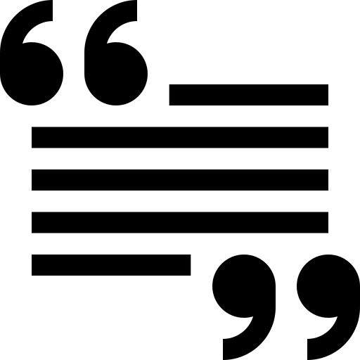

<div align="center">

#  **EvoSeed** 

</div>

 Source for the article: [Breaking Free: How to Hack Safety Guardrails in Black-Box Diffusion Models!](https://arxiv.org/abs/2402.04699)

##  Key Contributions:

- We propose a black\nobreakdash-box algorithmic framework based on an Evolutionary Strategy titled EvoSeed to generate natural adversarial samples in an unrestricted setting.
- Our results show that adversarial samples created using EvoSeed are photo-realistic and do not change the human perception of the generated image; however, can be misclassified by various robust and non-robust classifiers.

<div align="center">
    
</div>
Figure: Adversarial images created with EvoSeed are prime examples of how to deceive a range of classifiers tailored for various tasks.
Note that, the generated natural adversarial images differ from non-adversarial ones, suggesting the adversarial images' unrestricted nature.

##  Citation:

If you find this project useful please cite:

```
@article{kotyan2024EvoSeed,
  title = {Breaking Free: How to Hack Safety Guardrails in Black-Box Diffusion Models!,
  author = {Kotyan, Shashank and Mao, Po-Yuan and Chen, Pin-Yu and Vargas, Danilo Vasconcellos},
  year = {2024},
  month = may,
  number = {arXiv:2402.04699},
  eprint = {2402.04699},
  publisher = {{arXiv}},
  doi = {10.48550/arXiv.2402.04699},
}
```
