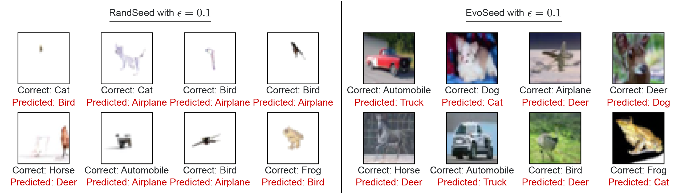

<div align="center">

# **🎏 EvoSeed 🎏**

</div>

Source for the article: [Breaking Free: How to Hack Safety Guardrails in Black-Box Diffusion Models!](https://arxiv.org/abs/2402.04699)

## 🌟 Features

- A model-agnostic black-box algorithimic framework based on Evolutionary Strategy to generate unrestricted natural adversarial samples


<div align="center">
    
</div>
Visualization of the generated natural adversarial samples by Random Search (RandSeed) and proposed EvoSeed.

## 📝 Citation

If you find this project useful please cite:

```
@article{kotyan2024EvoSeed,
  title = {Breaking Free: How to Hack Safety Guardrails in Black-Box Diffusion Models!,
  author = {Kotyan, Shashank and Mao, Po-Yuan and Vargas, Danilo Vasconcellos, Chen and Pin-Yu},
  year = {2024},
  month = may,
  number = {arXiv:2402.04699},
  eprint = {2402.04699},
  publisher = {{arXiv}},
  doi = {10.48550/arXiv.2402.04699},
}
```
